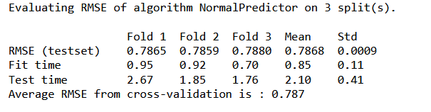
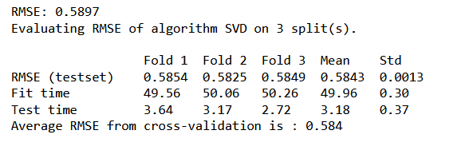
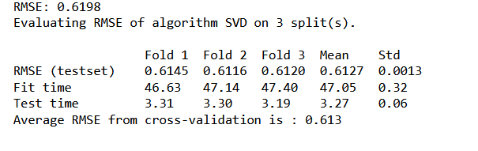
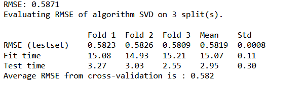
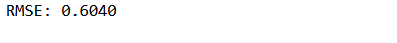

# Steam Games Recommendation System


# 

## Overview

In this project, I aim to develop a collaborative filtering recommendation system tailored for Amazon digital music. By leveraging user interactions with music items, such as ratings or purchase histories, the system will analyze patterns and similarities among users and items to generate personalized music recommendations. The project will involve preprocessing the Amazon digital music dataset, training various collaborative filtering models, and evaluating their performance using metrics such as accuracy and coverage. Ultimately, the goal is to deploy a robust recommendation system that enhances the user experience by providing relevant and personalized music suggestions based on their preferences and behaviors.


## Business Understanding

In the realm of digital music, enhancing user engagement and satisfaction is paramount for online platforms like Amazon. By implementing a collaborative filtering recommendation system, Amazon aims to provide users with personalized music recommendations that resonate with their tastes and preferences. This not only fosters a more enjoyable user experience but also increases user retention and loyalty. Additionally, by surfacing relevant music content, Amazon can potentially boost sales and revenue through increased music streaming or purchases. Understanding user preferences and behavior through collaborative filtering enables Amazon to tailor its offerings and marketing strategies, ultimately leading to a more successful and customer-centric digital music platform.

## Data Understanding and Preprocessing

The dataset, was pulled from a compiled dataset of Amazon.The data set can be found in [here](https://nijianmo.github.io/amazon/index.html).The data contains two zipped JSON files: the review and metadata. Due to the large size of the data, GitHub couldn't allow me to upload it here, but it can be found on the link I provided above.

Given that the rating distribution is not normal, it could influence our recommendation system model. Hence, we'll generate a new normalized rating column by subtracting the average rating of each reviewID from the original rating.

# 


# Modeling and Evaluation
We are constructing a Collaborative Recommendation System utilizing the Python package "surprise". Our initial step involved establishing a baseline model using the "Normal Predictor", which serves as a benchmark for comparison with our optimized final model. Through an iterative approach, we experimented with various models available in the surprise library, including "SVD" and "SVD++". To assess the performance of these models, we employed cross-validation techniques and evaluated metrics such as RMSE (Root Mean Squared Error) and MAE (Mean Absolute Error).


#### Normal Predictor 



#### SVD_basic



#### SVD_2


#### SVD_3


### SVDpp_basic


#### SVDPP_2



## Next Step

The next steps in developing the collaborative filtering recommendation system for Amazon digital music involve further refinement and optimization of the models. This includes experimenting with additional algorithms available in the surprise library, such as neighborhood-based methods or ensemble techniques, to identify the most effective approach for generating accurate recommendations. Additionally, feature engineering and data preprocessing techniques may be explored to enhance the quality of the input data. Furthermore, fine-tuning hyperparameters and conducting more extensive evaluations using different performance metrics will help to validate the robustness and effectiveness of the recommendation system.


## Repo Structure

```
├── Images
├── data
├── .gitignore
├── License
├── README.md
├── Data_Cleaning.ipynb 
├── Recommendation_System.ipynb 
├── content_based.ipynb 
├── SVD3.pkl ---------------->          Final Model

```
