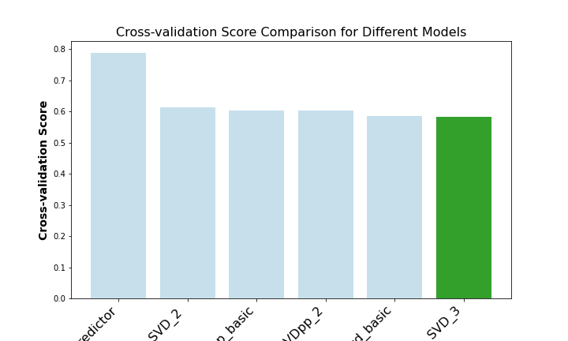

# Steam Games Recommendation System


# 

## Overview

In this project, I aim to develop a collaborative filtering recommendation system tailored for Amazon digital music. By leveraging user interactions with music items, such as ratings or purchase histories, the system will analyze patterns and similarities among users and items to generate personalized music recommendations. The project will involve preprocessing the Amazon digital music dataset, training various collaborative filtering models, and evaluating their performance using metrics such as accuracy and coverage. Ultimately, the goal is to deploy a robust recommendation system that enhances the user experience by providing relevant and personalized music suggestions based on their preferences and behaviors.


## Business Understanding

In the dynamic landscape of digital music, platforms like Amazon face the perpetual challenge of enhancing user engagement and satisfaction. With an abundance of music choices available, users often struggle to discover content that resonates with their preferences. To address this, Amazon is implementing a collaborative and content based filtering recommendation system aimed at providing personalized music suggestions. This initiative serves the needs of both users, who seek streamlined music discovery experiences, and Amazon, which aims to boost user retention, loyalty, and ultimately, revenue. By leveraging user data to tailor recommendations, Amazon not only fosters a more enjoyable user experience but also potentially increases sales through enhanced engagement with relevant music content.

## Data Understanding

The dataset utilized in this project consists of Amazon digital music reviews spanning from May 1996 to October 2018. The data was sourced from a compiled dataset available on the Amazon website. You can access the dataset through the provided [here](https://nijianmo.github.io/amazon/index.html). It comprises two zipped JSON files: one containing the reviews and the other containing metadata. Due to its substantial size, the dataset couldn't be uploaded directly to GitHub, but you can download it from the link provided.


After downloading the file it is ziped JSON file you can use the following code snippit 

path_music='./Data/Digital_Music.json.gz'


```python
import gzip
import pandas as pd

# Path to the zipped JSON file containing music data
path_music = "path/to/your/music/file.json.gz"

# Open the zipped JSON file using gzip and read it as a text file
with gzip.open(path_music, 'rt', encoding='utf-8') as file:
    # Use pd.read_json to parse the JSON content into a DataFrame
    music = pd.read_json(file, lines=True)
```

The dataset includes reviews (ratings, text, helpfulness votes), product metadata (descriptions, category information, price, brand, and image features)


## Data Preparation

To clean the data, I utilized a function built within the Pandas library. In the review data, I discarded columns deemed irrelevant for modeling and dropped null values, focusing on essential columns like ASIN, ReviewerID, and ReviewText. Next, I extracted style information and merged it with the metadata. The metadata required additional cleaning due to numerous null values. After dropping unused columns, I retained essential attributes such as title, description, ASIN, brand, and style.

Addressing the collaborative filtering aspect, the ratings exhibited a non-normal distribution. To mitigate bias, I subtracted the average rating given by each user to all items from each item rated by that user.


<div style="display:flex; justify-content:space-around;">
    
    
</div>


# Modeling and Evaluation

We are constructing a Collaborative Recommendation System utilizing the Python package "surprise". Our initial step involved establishing a baseline model using the "Normal Predictor", which serves as a benchmark for comparison with our optimized final model. Through an iterative approach, we experimented with various models available in the surprise library, including "SVD" and "SVD++". To assess the performance of these models, we employed cross-validation techniques and evaluated metrics such as RMSE (Root Mean Squared Error) and MAE (Mean Absolute Error).

# Collaborative Filtering

The collaborative filtering approach employed in the a function which is a powerful method for generating personalized recommendations for users based on their historical interactions with music album and the behavior of similar users. By leveraging the patterns and preferences observed among users, collaborative filtering can effectively predict how users might rate or interact with items they have not yet encountered.After iterating through various surprise model algorithms and conducting grid searches, I ultimately selected my final model, SVD_3. This model yielded the lowest Root Mean Squared Error (RMSE) among all tested models, achieving a score of 0.58 rating.



In this implementation, the function first identifies items that the specified user has not reviewed. It then predicts ratings for these unreviewed album music using a collaborative filtering algorithm, in this case, Singular Value Decomposition (SVD). The algorithm estimates how the user might rate each item by considering their past behavior as well as the behavior of other users with similar tastes. Finally, the function returns the top N recommendations, providing the user with a tailored list of items that are likely to be of interest to them. This approach enhances user satisfaction and engagement by offering personalized recommendations, ultimately improving the overall user experience on the platform.


## Content-Based

The function for content-based implements a content-based recommendation system, a method that suggests items to users based on the features or characteristics of the items themselves rather than relying on user-item interactions. In this context, the function identifies items with similar attributes to a target item specified by its ASIN (Amazon Standard Identification Number). It utilizes a pre-trained content model and a similarity search algorithm, such as cosine similarity, to find items with vectors closest to the target item's vector representation in a high-dimensional space. By comparing the features of items, such as title, description, or other metadata, content-based recommendation systems can identify items that share similar characteristics to the target item. This approach is particularly useful when there is sufficient item metadata available and can provide personalized recommendations based on the specific attributes of items, enhancing user satisfaction and aiding in item discovery.


## Streamlit App

Leveraging the function, dataset, and pickled collaborative filtering model, I've crafted a Streamlit application poised for deployment. This application promises seamless user interaction and personalized music recommendations.


## conclusion

Throughout the development of the collaborative and content-based recommendation systems in this project, a multifaceted approach to data preprocessing was employed. Initially, in the collaborative filtering aspect, meticulous attention was devoted to understanding user behavior through thorough analysis of rating patterns. Leveraging collaborative filtering algorithms, such as Singular Value Decomposition (SVD), the system adeptly identified latent relationships among users and items, enabling the generation of personalized recommendations. 

the content-based recommendation system, exemplified by the get_similar_titles function, plays a pivotal role in enhancing the music discovery experience on our platform. By analyzing intrinsic attributes such as title, description, and genre, content-based recommendation identifies music items with similar characteristics to a target item. This approach excels in recommending niche or lesser-known items that may not have garnered substantial user interactions yet. By focusing on the inherent features of items, content-based recommendation tailors recommendations to specific user preferences and interests, enriching the platform's recommendation capabilities and facilitating personalized music exploration.


## Next Step

The next steps in developing the collaborative filtering recommendation system for Amazon digital music involve further refinement and optimization of the models. This includes experimenting with additional algorithms available in the surprise library, such as neighborhood-based methods or ensemble techniques, to identify the most effective approach for generating accurate recommendations. Additionally, feature engineering and data preprocessing techniques may be explored to enhance the quality of the input data. Furthermore, fine-tuning hyperparameters and conducting more extensive evaluations using different performance metrics will help to validate the robustness and effectiveness of the recommendation system.


## Repo Structure

```

├── Data
├── Images
├── Notebooks
├── .gitignore
├── License
├── README.md
├── Data_Cleaning.ipynb 
├── Recommendation_System.ipynb 
├── content_based.ipynb 
├── SVD3.pkl ---------------->          Final Model

```

## Citation

ustifying recommendations using distantly-labeled reviews and fined-grained aspects
Jianmo Ni, Jiacheng Li, Julian McAuley
Empirical Methods in Natural Language Processing (EMNLP), 2019 [pdf](https://cseweb.ucsd.edu/~jmcauley/pdfs/emnlp19a.pdf)
